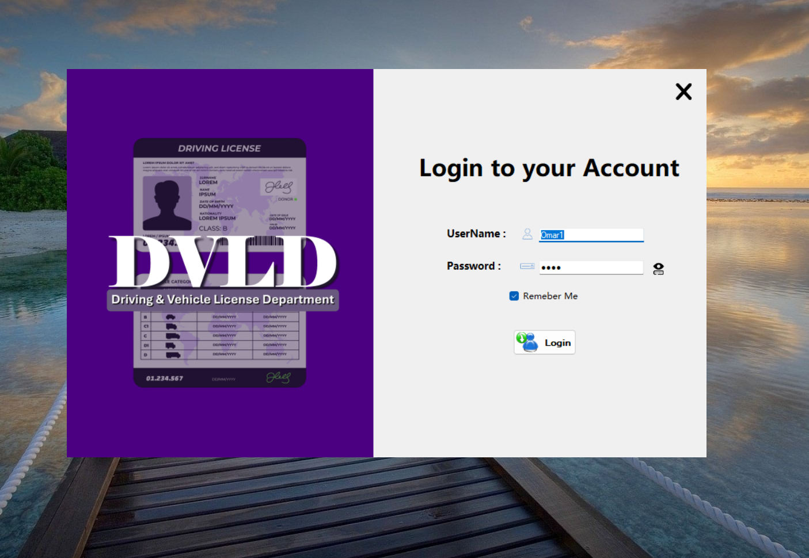
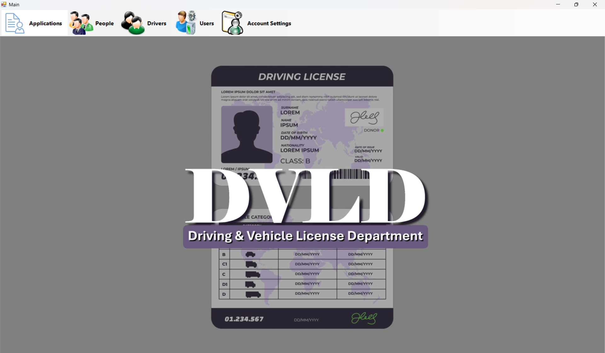
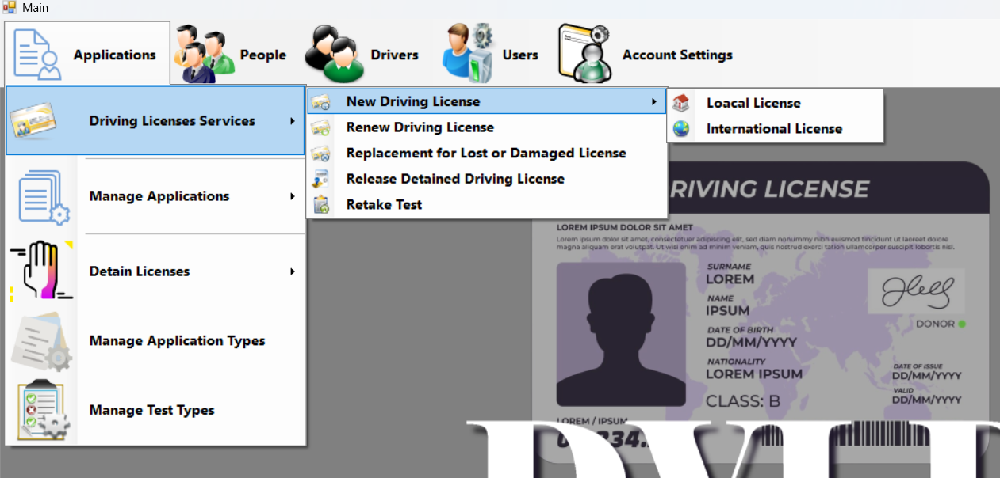
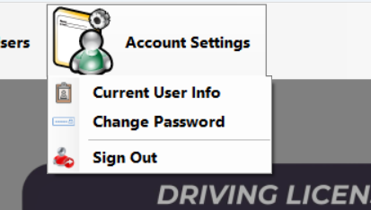
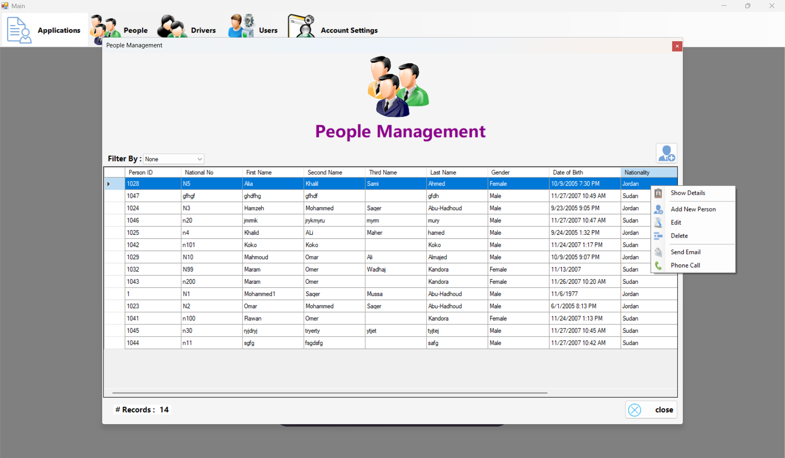
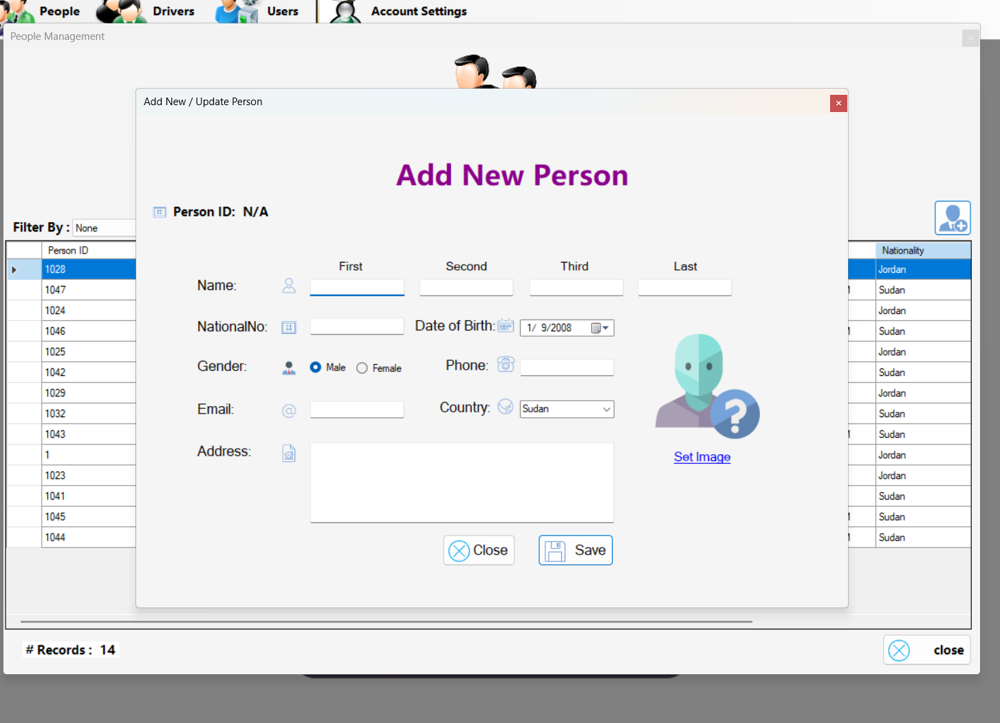
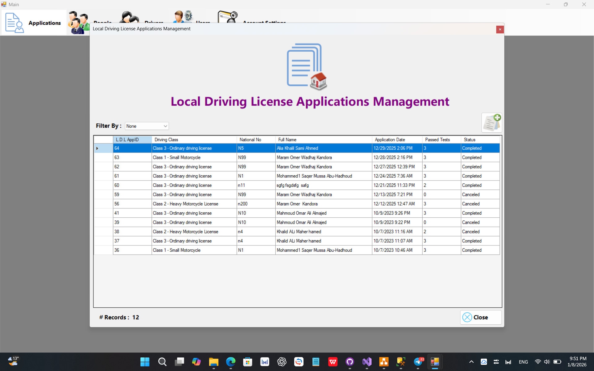
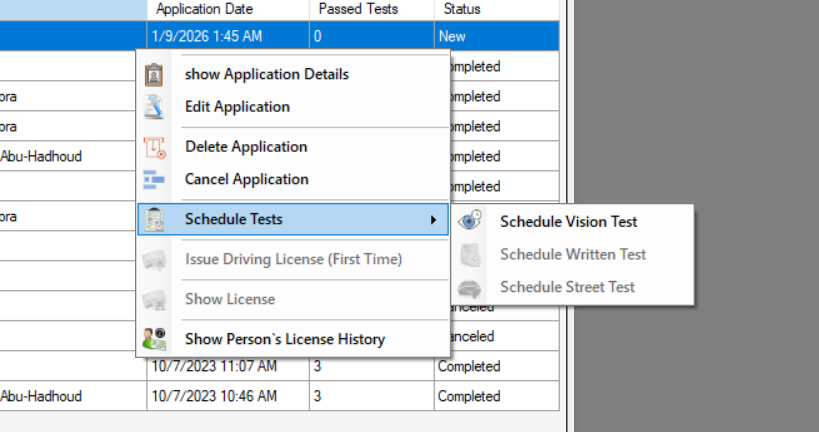

# DVLD – Driving & Vehicle License Management System
## Overview

The DVLD (Driving & Vehicle License Department) Management System is a desktop-based application designed to manage the full lifecycle of driving licenses and related services. It manages the core operations of a real-world driving license department, including issuing licenses, managing applicants, handling tests, and providing administrative services.

This project focuses on clean architecture, OOP principles, and real-world business rules, rather than relying on ready-made shortcuts.

## Technologies Used

Language: C#

Framework: .NET Framework (WinForms)

Database: SQL Server

Architecture: 3-tier Architecture (UI, Business Logic, Data Access)

## Main Features

### Person Management

- Add, update, delete, and search persons by ID and National No

- Prevent duplicate records

- Store personal information and profile image

### Application Management

- Create and track applications for different services

- Application statuses: New, Completed, Cancelled

- Each application is linked to a single person

### License Services

- Issue a driving license for the first time

- Renew driving licenses

- Replace lost or damaged licenses

- Release seized licenses

- Issue international driving licenses

### Tests Management

- Vision Test

- Theoretical Test

- Practical Driving Test

- Track test results, dates, fees, and retries

### License Classes

- Multiple license categories (motorcycles, cars, commercial, heavy vehicles, etc.)

- Enforced age restrictions

- Validity period and fees per class

### Users & Administration

- Manage system users

- Log all system actions with date and user

## Screenshots

## Login Screen

## Main Screen

## People Management

## Loacal License Applications

## Drivers List

## What I Learned

Designing real-world systems from requirements

Translating business rules into code

Building maintainable and extensible code

## How to run
Clone the repositry
